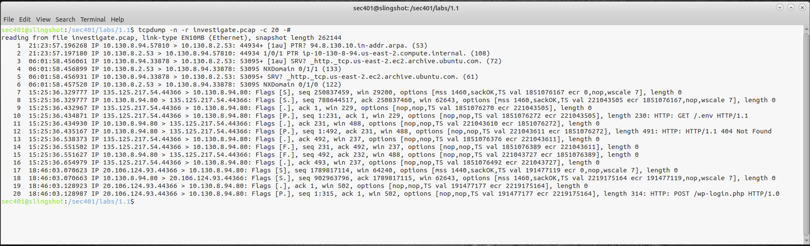
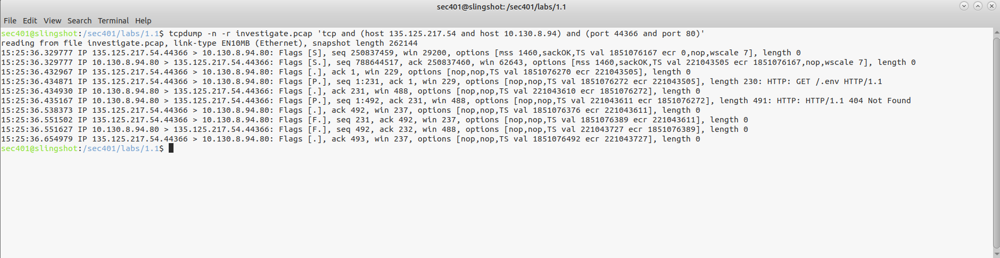
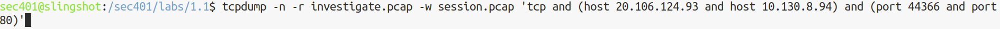
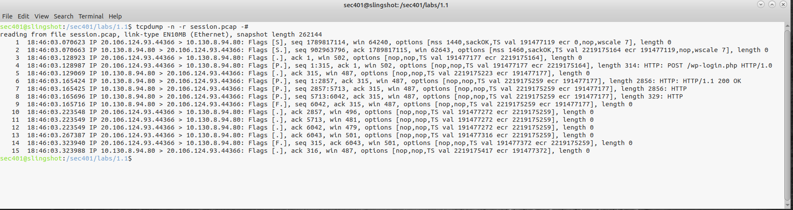
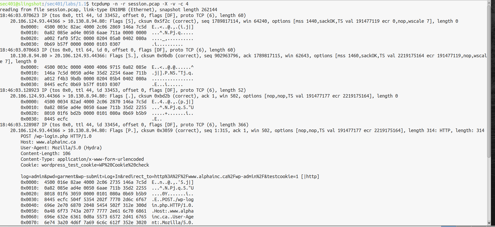
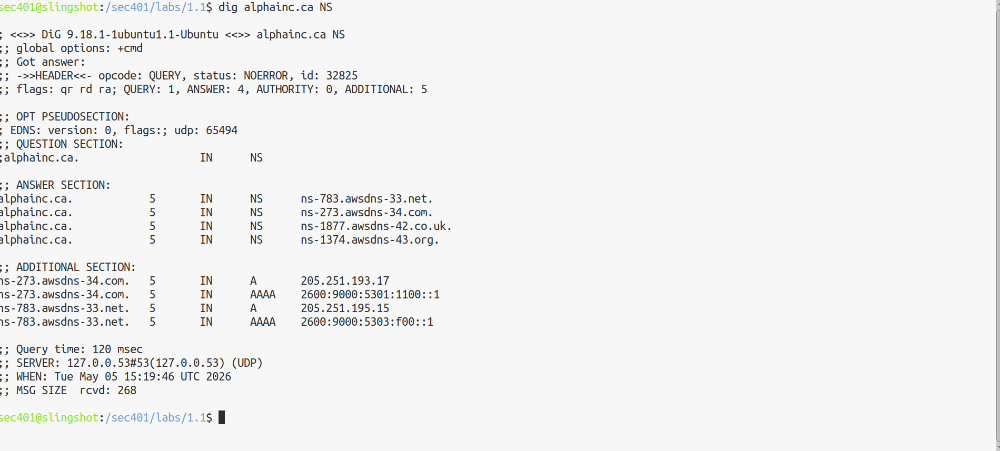

# Lab-1.1-tcpdump-Traffic-Analysis

## Overview:
This lab demonstrates how tcpdump, a command-line tool used for network packet capture, is used to analyze network traffic and correlate to suspicious activity

A PCAP file was obtained from a compromised webserver at Alpha.Inc. It was my job to investigate the network traffic to and from the sever to help in the investigation.

## 1: Packet Header Examination

-n no DNS

-r pcap file to read from

-c 20 analyze the first 20 packets

-# display packet number

## 2: Filtering the Traffic

Filtering the TCP traffic between 135.125.217.54 and 10.130.8.94 on ports 44366 and 80 showed a GET request for ./env. The server responded with a 404 not found error.

## 3: Write/Read to session.pcap

Writing (to a new file) the output of traffic between 20.106.124.93 and 10.130.9.94 on ports 44366 and 80

And reading the new session.pcap file 

I saw the filtered WordPress login packets.

## 4: Examine Packet Contents – HTTP payloads – Visible logins
Reading the raw packet content from the session.pcap file revealed HTTP POST to /wp-login.php with a Hydra user-agent (brute force password tool)

-X hex and ASCII payload

-v verbose output

## 5: Capturing Live Traffic With dig 
Capture live UDP traffic on port 53 (DNS) and write the captured contents to a pcap file

-i interface

And used the dig command to send traffic while tcpdump was listening

## Takeaways:
This lab showed how clear attacker behaviour sticks out in raw packet captures, once understanding how and what to filter for. It also showed how readable and dangerous plaintext HTTP traffic is. Credentials were fully visible in the packet payload.

The ./env probe is a common automated scan on the internet. Here, even with a 404 error meaning the file wasn’t there, it let the attacker know a server is live and worth further probing; the brute-force password attack followed subsequently. 

From a security perspective, enforcing HTTPS in production, limiting wp-login attempts, implementing firewall rules for ./env probing, and centralized logging/alerting (SIEM) are some controls that could mitigated this incident. 

